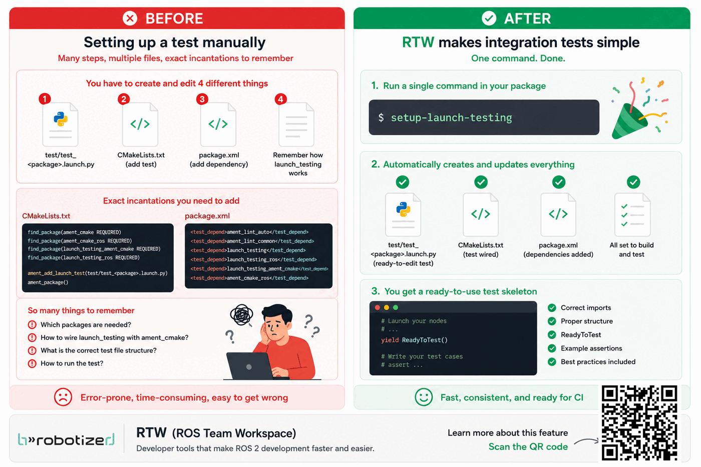

.. _uc-setup-launch-testing:

Automatic Testing
--------------------

When you develop a new feature and open an MR, you usually write instructions for others on how to check that your feature works. These instructions often include:

- Launching nodes, launch files, or scripts
- Observing or verifying that certain behaviors happen

Automatic testing does exactly the same thing, but without a human: it runs your nodes, launch files, and checks the expected behavior automatically.

The most two important types of testing:

- Unit Test: Check a small piece of code by itself (like making sure a function adds numbers correctly). Framework used is gtest for c++ or pytest for python.
- Integration Test: Check multiple pieces working together (like your node working with MoveIt). Framework used is launch_testing

Since most of our frameworks need MoveIt to run, we mostly do integration tests.

launch_testing
---------------

``launch_testing`` is a framework in ROS 2 that lets you launch a system and automatically test how it behaves. It works just like a normal launch file, but with an extra step: after launching your nodes, it runs Python test cases that check if the system behaves as expected.

It has three components:

- ``generate_test_description``: similar to a normal launch file but wrapped inside a Python function.
- Test code: python code that runs the components of your feature under test after the system is launched (ex: request service or subscribe to topic)
- Asserts: the checks that decide if the test passes or fails.

  - ``assertTrue``
  - ``assertFalse``
  - ``assertIsNotNone``
  - ``assertEqual``
  - ``assertAlmostEqual``
  - ``assertCountEqual``

Step-by-step: testing
-------------------------

Step 1: Add the test system backbone
~~~~~~~~~~~~~~~~~~~~~~~~~~~~~~~~~~~~~~~~~~

1. From the top-level of your package folder, run:

   .. code-block:: bash

      setup-launch-testing

   This creates ``test/test_<package_name>.launch.py`` from the template and automatically adds
   the required ``test_depend`` entries to ``package.xml`` and the ``if(BUILD_TESTING)`` block
   to ``CMakeLists.txt``.

Step 2: Add launch description
~~~~~~~~~~~~~~~~~~~~~~~~~~~~~~~~~~

1. Replace the ``generate_test_description`` function in the template with whatever needed to be launched to run your system. You can include pre-existing launch files. If you will be using same launch file to both run and test the system, then it is prefrable to include parameters that enable/disable settings like launching rviz or other unneeded UI components.
2. Change the time delay in ``TimerAction(period=0.5`` to whatever is needed to launch your system.

Step 3: Define the testcases
~~~~~~~~~~~~~~~~~~~~~~~~~~~~~~~~

1. Think about what elements you want to test in your code. What are the indications that would tip you off that the code is not/working properly? Examples are:
   - service/action server is not available.
   - client futures that never return.
   - response status code that is not 0.
   - service/action response/feedback not as expected.
   - Topic not publishing the message at all or not as expected.
   - An object doesn't exist in the planning scene at all or not where it is supposed to be.
   - Joint states are incorrect.
   - Behavior tree returns successfully.
2. It is important for all your features to have a way of scriptable verification, not just visual. Anything you can do in your normal node, you can typically do in the testcase like requesting the planning scene and parsing it to get the current pose of an object you moved.
3. After you brainstormed your testcases, name and add them to the class in separate functions. Each function is a testcase.
4. The testcases run sequentially, so if one of the testcases (ex: moving an object) depends on another (adding an object), make sure the testcases order is reflected.

Step 4: Implement the testcases
~~~~~~~~~~~~~~~~~~~~~~~~~~~~~~~~

Edit/add testcases like the one in the template. Each testcase should start by triggering a behavior (calling a service or subscribing to a topic) and end by asserting the response.

Step 5: Give it a try!
~~~~~~~~~~~~~~~~~~~~~~~~

RTW provides short aliases for all colcon commands (available after sourcing your workspace):

.. code-block:: bash

   cb <package_name>    # build
   ct <package_name>    # test
   ctres                # show test results

For verbose live output while tests are running:

.. code-block:: bash

   colcon test --event-handlers console_direct+ --packages-select <package_name>

---

Tips
------

- The ``TIMEOUT`` value in ``add_launch_test`` is in **seconds**. The default generated by the
  script is 600 s (10 min). Increase it for heavy integration tests that run on slow CI machines.
  Edit ``CMakeLists.txt`` as needed:

.. code-block:: cmake

   if(BUILD_TESTING)
     add_launch_test(
       test/test_package_name.launch.py
       TIMEOUT 600  # seconds
     )
   endif()

Resources
----------

- https://docs.ros.org/en/rolling/Tutorials/Intermediate/Testing/Integration.html
- https://arnebaeyens.com/blog/2024/ros2-integration-testing/
